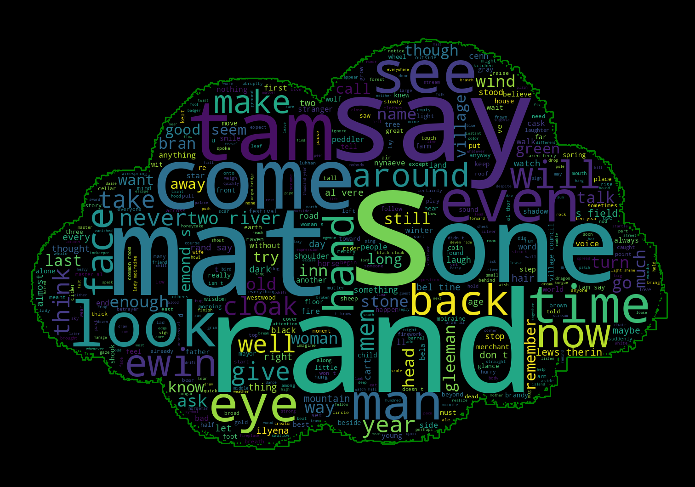

# WordCloud Generator

[](https://www.gnu.org/licenses/gpl-3.0.html)

Welcome to wordcloud-cli! This project is a WordCloud generator that creates visually appealing word clouds from a given text input. The inspiration behind this project was to export WhatsApp conversations as text files and utilize them as data sources for generating word clouds.



# Installation

To use wordcloud-cli, follow these installation steps:

1. **Begin by cloning this repository:**

    ```sh
    $ git clone https://github.com/LucasRochaAbraao/wordcloud-cli.git
    ```

2. **Navigate to the Project Directory:**

    ```sh
    $ cd wordcloud-cli
    ```

3. **Set Up a Virtual Environment -** It's recommended to create a virtual environment to manage project dependencies:

    ```sh
    $ python -m venv .venv
    (.venv)$  source .venv/bin/activate
    ```

4. **Install Dependencies using `pip`:**

    ```sh
    (.venv)$  pip install -r requirements.txt
    ```

# Usage

Generating word clouds with wordcloud-cli is easy! Just follow these steps:

1. **Prepare Your Text Data:** Create a text file containing the text data you want to visualize.

2. **Run the `wordcloud_generator.py` script** and provide the name of your text file (which should be placed inside the `data/` directory) as an argument:

    ```sh
    (.venv)$  python wordcloud_generator.py sample.txt
    ```

    Replace `sample.txt` with the actual name of your text file, which should be inside the `data/` directory.

3. **Enjoy the Results -** The script will process the text data, generate a word cloud, and save it as an image in the `output` directory. You'll also see a word frequency table printed in the console, highlighting the most frequently used words in the text.

4. **Customization (Optional) -** You can further customize the appearance of the word cloud by modifying settings in the `data/settings.toml` file. Adjust parameters like stopwords, laughter patterns (so they are normalized into one), and more to fine-tune the generated word cloud.

## License

This project is licensed under the [GNU General Public License v3.0](https://www.gnu.org/licenses/gpl-3.0.html).

Feel free to contribute, provide feedback, or use this tool for your own creative projects!
